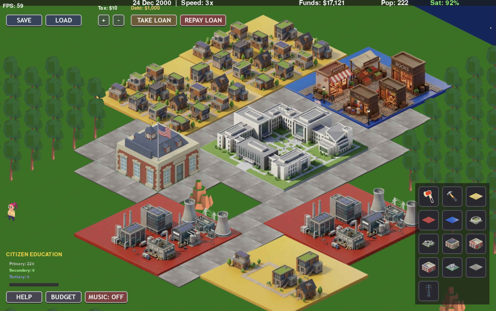

# Isometric City Builder

A tycoon-like real-time city builder game built with Python and Pygame. As the mayor, you are tasked with developing a prosperous city, managing the economy, and keeping your citizens satisfied. 
<p align="center">
  
</p>
This engine features a fully functional 2.5D isometric grid system, dynamic multi-tile building placement, interactive tools, and a real-time calendar system.


## ELTE University Task Description

This project is based on an assignment for the Software Technology Practice course. It was assigned during the 2022/2023 Spring Semester at the ELTE Faculty of Informatics. 

The core requirements and objectives of the task include:
* **Core Concept**: Implement a tycoon-like real-time city builder game. The gameplay should be similar to the Sim City series. 
* **Player Role**: The player acts as a mayor managing a well-defined area of square fields. The main goal is to build a prosperous city where citizens are happy and the budget remains balanced.
* **Zoning & Growth**: The player can assign residential, industrial, and service zones. Citizens will automatically build apartments and workplaces in these designated zones at no additional cost. 
* **Infrastructure**: Citizens will only build on a zone if it is accessible from a public road on at least one side. Citizens must also be able to travel via public road from their residence to their workplace.
* **Service Buildings**: The player must manually construct and pay annual maintenance fees for service buildings. Examples include Police stations (for public safety) and Stadiums (which occupy a 2x2 area and boost satisfaction).
* **Economy**: The player receives starting capital but must eventually rely on tax revenues. An annual fixed tax amount can be levied on each populated zone space. 
* **Time Management**: The game plays in real-time but much faster than reality. The UI must display the date (year, month, day), and allow the player to run the game at 3 different speeds or pause it.
* **Persistence**: It should be possible to save and load the game, and to manage multiple saves.
* **Graphics**: While the basic requirement is a 2D top-down view, bonus points are awarded for implementing 2.5-dimensional isometric graphics where buildings visually extend beyond their base cell.

## Additional Advanced Features

* **2.5D Isometric Engine:** Procedurally generated terrain using Perlin noise with fully mathematically calculated isometric projection and depth-sorting.
* **Multi-Tile Support:** Support for large structures (e.g., 4x4 Residential Zones, 2x2 Stadiums) that correctly span multiple grid coordinates.
* **Dynamic Zoning:** Zone residential, industrial, and service areas where citizens will automatically settle and work. Citizens distribute themselves equally among available industrial and service jobs.
* **Metropolis Upgrades:** Zones can be upgraded to higher levels, increasing their capacity and changing their visual appearance.
* **Road Networks:** A fully functional road system that connects zones and service buildings.
* **Vehicles and Traffic:** Watch citizens travel between their homes and workplaces on the road network. Vehicles spawn dynamically based on population density and avoid collisions.
* **Complex Satisfaction System:** Citizen happiness is calculated based on taxes, job availability, industrial pollution, public safety, and city debt. Low satisfaction can cause citizens to leave, or even result in the mayor being fired.
* **Economic Simulation:** A deep budget system requiring you to balance construction costs, annual maintenance fees, and tax revenue. Includes a scrollable ledger and the ability to take out loans.
* **Power Grid:** Build power plants and route electricity via contiguous zones and high-voltage power lines. Buildings without power cease to function, dropping satisfaction and tax revenue.
* **Education System:** Construct Schools and Universities to provide secondary and tertiary education, boosting the income and tax revenue generated by citizens.
* **Nature & Forests:** Plant trees that grow over a 10-year cycle, improving local satisfaction and mitigating industrial pollution.
* **Fire & Rescue:** Buildings can randomly catch fire. Build Fire Stations to lower fire risk and watch as dispatched fire trucks navigate the city to extinguish blazes before they spread or destroy buildings.
* **Disasters:** Trigger a devastating "DINOSAUR ATTACK" that ravages the city, complete with custom visuals and sound effects.
* **Demolition Safeguards:** Demolishing occupied buildings or critical roads triggers a warning UI, calculating severance costs, displaced citizens, and satisfaction penalties.
* **Time & Speed Controls:** A functional calendar system that drives simulation logic. Players can pause (`SPACE`) or cycle between 1x, 2x, and 3x speeds.
* **Save/Load Management:** An interactive UI overlay to manage up to 3 separate save slots, writing serialized game states to JSON.

## Controls

* **Left Click**: Select / Place / Examine building.
* **Right Click**: Deselect tool / Close examine HUD.
* **Mouse Movement**: Pan the camera at the edges of the screen.
* **Spacebar**: Pause / Unpause the game simulation.
* **1, 2, 3**: Change simulation speed (1x, 2x, 3x).
* **F5**: Quick Save.
* **F9**: Quick Load.
* **ESC**: Close menus or quit.

## Installation & Running

1. Ensure you have Python 3.x installed.
2. Install the required dependencies:
   ```bash
   pip install -r requirements.txt
   ```
3. Run the main game file:
   ```bash
   python __main__.py
   ```
